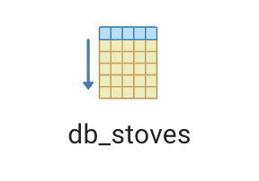
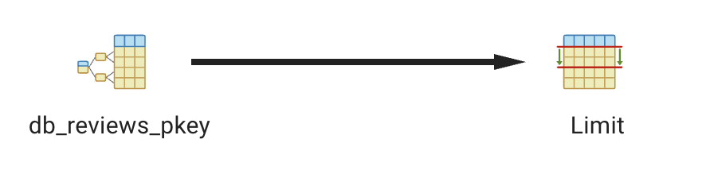

# Django ORM - Investigating Queries

## Sequential Scan
- Django ORM Code:
    ```
    s = Stoves.objects.all()
    print(f"{len(s)}")
    ```
- SQL Query:
    ```
    SELECT "db_stoves"."id", "db_stoves"."stove_url", "db_stoves"."dimensions", "db_stoves"."experience", "db_stoves"."price", "db_stoves"."climate", "db_stoves"."stove_location", "db_stoves"."use" FROM "db_stoves";
    ```

- Screenshot From pgAdmin:



- Reflection:
It used a sequential scan due to the fact the query is asking postgres to retrieve every row and every column from the table. This means it doesnt use the index at all, therefore it is a sequential scan. 

## Index Scan
- Django ORM Code:
    ```
    s = Stoves.objects.all().filter(review_id=1)
    print(s)
    ```
- SQL Query:
    ```
   SELECT "db_reviews"."review_id", "db_reviews"."user_id_id", "db_reviews"."stove_id_id", "db_reviews"."rating", "db_reviews"."comment", "db_reviews"."created_at" FROM "db_reviews" WHERE "db_reviews"."review_id" = '00000000-0000-0000-0000-000000000001'::uuid LIMIT 21;
    ```

- Screenshot From pgAdmin:



- Reflection:
It used an index scan as the query is asking for all the info of the review with an ID 1. Since`review_id` has an explicit index (as it is a primary key), it uses this index to find then access the rest of the row. The fact this is only using the index to access the rest of the row is what makes it differ form an Index Only Scan.  

## Index Only Scan
- Django ORM Code:
    ```
    Stoves.objects.filter(id=1).count()
    ```
- SQL Query:
    ```
     SELECT COUNT(*) AS "__count" FROM "db_stoves" WHERE "db_stoves"."id" = 1;
    ```

- Screenshot From pgAdmin:


- Reflection:
It uses an Index Only Scan as the query is asking how many stoves have an ID of 1, rather than the information within the stove with ID 1. This means it only need to use the index to fufil the task of the query. 