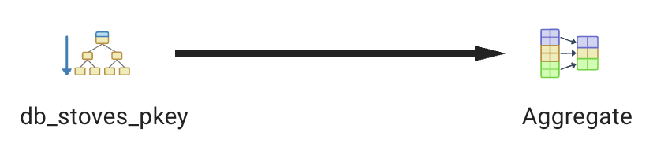

# Django ORM - Investigating Queries

## Sequential Scan
- Django ORM Code:
    ```
    s = Stoves.objects.all()
    print(f"{len(s)}")
    ```
- SQL Query:
    ```
    SELECT "db_stoves"."id", "db_stoves"."stove_url", "db_stoves"."dimensions", "db_stoves"."experience", "db_stoves"."price", "db_stoves"."climate", "db_stoves"."stove_location", "db_stoves"."use" FROM "db_stoves";
    ```

- Screenshot From pgAdmin:


## Index Scan
- Django ORM Code:
    ```
    s = Stoves.objects.all().filter(review_id=1)
    print(s)
    ```
- SQL Query:
    ```
   SELECT "db_reviews"."review_id", "db_reviews"."user_id_id", "db_reviews"."stove_id_id", "db_reviews"."rating", "db_reviews"."comment", "db_reviews"."created_at" FROM "db_reviews" WHERE "db_reviews"."review_id" = '00000000-0000-0000-0000-000000000001'::uuid LIMIT 21;
    ```

- Screenshot From pgAdmin:


## Index Only Scan
- Django ORM Code:
    ```
    Stoves.objects.filter(id=1).count()
    ```
- SQL Query:
    ```
     SELECT COUNT(*) AS "__count" FROM "db_stoves" WHERE "db_stoves"."id" = 1;
    ```

- Screenshot From pgAdmin:

