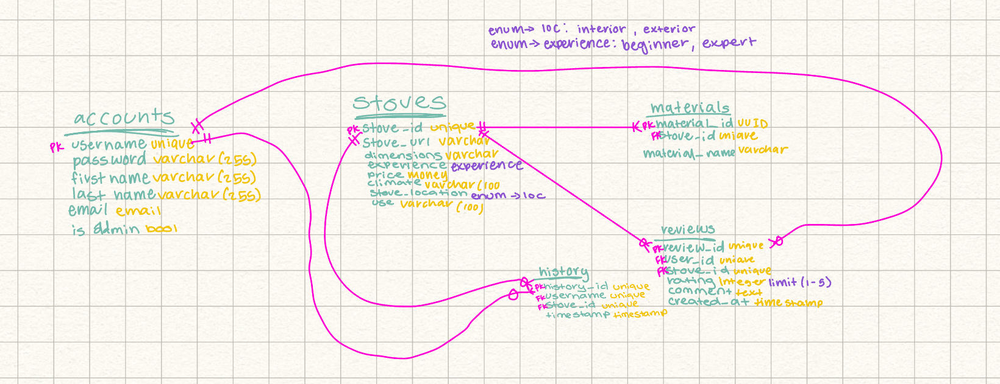

# Q3: Ivestigating Tables

## Link to ER Diagram and Create Table statements:
Here is the link to my original ER diagram
 

 
Heres the link to my original create table statements, which were written using python in [Django models.py](https://github.com/1bMedina/ucca/blob/main/final_project/ucca_web/models.py)
 

## Updated models.py:
Here is the link to my *slightly* updated models.py for this [current project](https://github.com/1bMedina/orm/blob/main/db/models.py)
 

## pgAdmin ER Diagram:
Here is the ER Diagram pgAdmin created for my models: 
 

## Short Reflection:
- How does the final ER diagram compare to the one you created manually? Is it exactly the same? Is there any difference that surprised you?
    - The ER diagram is very similar to the one I created initially, there are some slight changes as my models were modified a bit from the first go around, but other than that they are very similar. 
    - Nothing really suprised me, I excpected it to differ a little as I changed stuff surrounding the user and stoves. 
 

- How does the effort compare? If I asked you to create and document a new database, would you choose to follow the procedure that we followed in our end-of-semester project, or would you use Django?
    - They were the same effort as I literally just copied and pasted the models, and then edited them as needed to work with faker. 
    - I would use Django again, I feel like Django is really effiecent. Especially with the projects I like to do, Django would be best as it has so many different options and things to do with it. 
