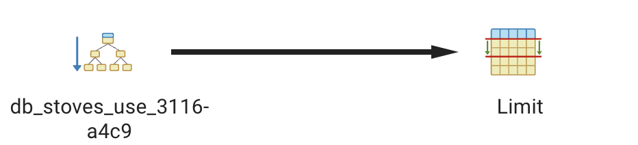
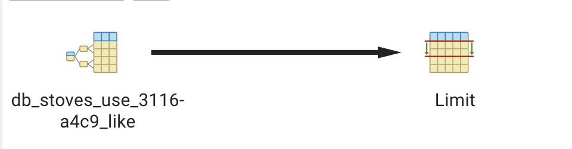
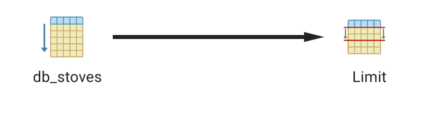
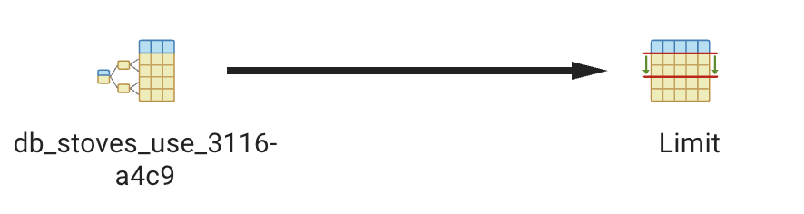

# Use The Index, Django! - Reflection

## A discussion of the two indexes that Django added, and the queries that use them.

Django added two indexes, a standard one and a 'like' one.

The standard one is used as an efficent way to find the exact match in an index. For instance, this query looks at use for a row that says exactly cooking and nothing else. 

```
SELECT "db_stoves"."use" AS "use" FROM "db_stoves" WHERE "db_stoves"."use" = '''Cooking''' LIMIT 21;
```



The like index is used to find a pattern within the index. For instance, this query is looking for anything that starts with the letter C in the use column

```
SELECT "db_stoves"."id", "db_stoves"."stove_url", "db_stoves"."dimensions", "db_stoves"."experience", "db_stoves"."price", "db_stoves"."climate", "db_stoves"."stove_location", "db_stoves"."use" FROM "db_stoves" WHERE "db_stoves"."use" LIKE 'C%' LIMIT 21;
```



## A comparison of the query plans generated when you use/don't use __iexact.

Using i_exact causes the query plan to ignore the index as its making sure that it is finding the *exact* value you requested by checking every row. This means it results in a sequential scan. Here is a comparison of the 2 query plans generated:

### With i_exact: 

```
 SELECT "db_stoves"."id", "db_stoves"."stove_url", "db_stoves"."dimensions", "db_stoves"."experience", "db_stoves"."price", "db_stoves"."climate", "db_stoves"."stove_location", "db_stoves"."use" FROM "db_stoves" WHERE UPPER("db_stoves"."use"::text) = UPPER('''Cooking''') LIMIT 21;
```

```
>>> s = Stoves.objects.filter(use__iexact="'Cooking'")
>>> print(s)
```



### Without i_exact:

```
SELECT "db_stoves"."id", "db_stoves"."stove_url", "db_stoves"."dimensions", "db_stoves"."experience", "db_stoves"."price", "db_stoves"."climate", "db_stoves"."stove_location", "db_stoves"."use" FROM "db_stoves" WHERE "db_stoves"."use" = '''Cooking''' LIMIT 21;
```

```
>>> s = Stoves.objects.filter(use="'Cooking'")
>>> print(s)
```



## Time difference:

<!-- for 1000 
```
With 1280 records in the table:
	- average time for query that uses index: 0.006 seconds
	- average time for query that does not use index: 0.011 seconds
```
for 10000
```
With 12280 records in the table:
	- average time for query that uses index: 0.006 seconds
	- average time for query that does not use index: 0.054 seconds
```
for 100000
```
With 112280 records in the table:
	- average time for query that uses index: 0.006 seconds
	- average time for query that does not use index: 0.502 seconds
```
for 1000000
```
With 1112280 records in the table:
	- average time for query that uses index: 0.009 seconds
	- average time for query that does not use index: 4.54 seconds
``` -->

### Time difference in a table:

|  |    1000 |   10000 |  100000 | 1000000
---------|---------|---------|---------|---------|
i_exact |   0.011 | 0.054 | 0.502 | 4.54
no i_exact |   0.006 | 0.006 | 0.006 | 0.009 |

## A short summary of the takeaways of this activity. Specifically, what additional warnings would you give to Django developers who are considering using the __iexact feature in their ORM code?

From this project I noticed that using `i_exact` forces the ORM to use a sequential scan, which is extremely slower as it forces the query to scan every row in order. `i_exact` also bypasses the standard index, which contributes to the slowness of it. Additionally, you can use two different types of indexes, the like or standard index, and each uses a different query plan. The standard index does an index only scan to look for the exact text match. The like index is used to speed up querying by looking for an aspect of the data you want, for example looking for anything that starts with "C".

I would warn that using `i_exact` instead of the regular index has a tremendous effect on the speed of the query. So if you want a fast query, use the standard index rather than looking using `i_exact` or use the like index for an even faster query, though it is less accurate. 

